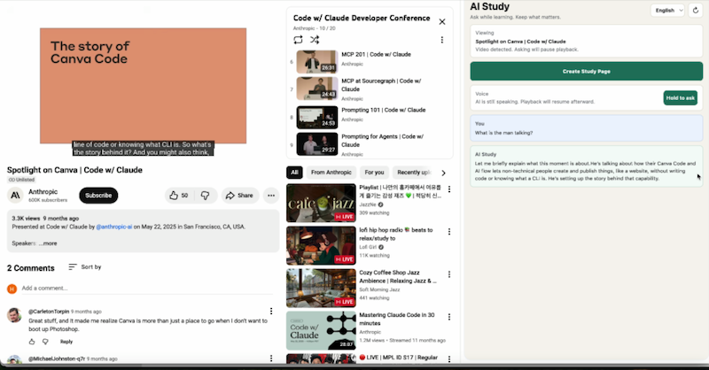
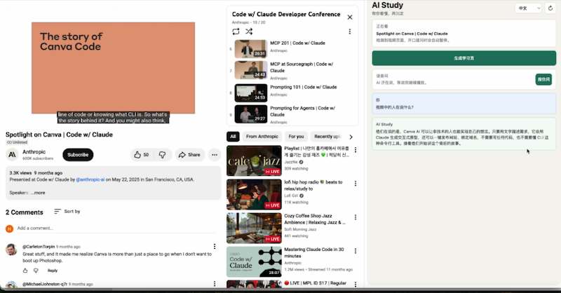

# LearnAlong AI

LearnAlong AI is a voice-first learning companion for the browser. Open a video, article, X thread, or documentation page, then hold to ask what you do not understand. It reads the current learning context, answers with Realtime voice, remembers useful notes locally, and can turn a study session into a shareable HTML article.

Ask while learning. Keep what matters.

## Demo

Click the thumbnails to watch the usage videos.

### English Demo

[](docs/demo/learnalong-ai-demo-en.mov)

### 中文演示

[](docs/demo/learnalong-ai-demo-zh.mov)

## What It Does

- **Hold to ask**: press and hold the button, or hold Space, to ask by voice.
- **Realtime voice answers**: uses OpenAI Realtime so the response feels conversational.
- **Video-aware context**: follows the current page, YouTube video state, transcript text, visible captions, and recent local timeline.
- **Playback control**: pauses video while you ask, then resumes after the AI finishes speaking.
- **Learning memory**: when you say things like “记一下”, it saves a local voice note with source URL and video timestamp.
- **Shareable study article**: generates an HTML article from the video/page context, with a hero image, readable sections, notable moments, concepts, takeaways, and notes distilled from your own questions.
- **Bilingual output**: supports Chinese, English, and bilingual article generation.
- **Local-first prototype**: stores notes in Chrome local storage. The long-lived OpenAI API key stays in the local Node server, not inside the extension.

## Current MVP Shape

The product is intentionally simple:

1. Open a learning page or YouTube video.
2. Ask questions by holding the voice button.
3. Let LearnAlong AI keep local notes when something matters.
4. Generate a polished HTML article when you want to review or share what you learned.

This is not a generic YouTube summarizer. The core idea is closer to “an AI learning partner that stays with you while you learn.”

## Project Structure

```text
learnalong-ai/
  extension/        Chrome / Edge side panel extension
  server/           Local Node server for OpenAI calls
  docs/             Product notes and demo videos
```

## Requirements

- Node.js 20+
- Chrome or Edge
- OpenAI API key with access to the configured Realtime and text models

## Run the Local Server

```bash
cp .env.example .env
```

Edit `.env` and add your OpenAI API key:

```bash
OPENAI_API_KEY="your-openai-api-key"
OPENAI_BASE_URL="https://api.openai.com"
```

Then load it into your shell:

```bash
set -a
source .env
set +a
npm run start
```

Health check:

```bash
curl http://localhost:8787/health
```

If OpenAI returns a regional hostname error, only then change `OPENAI_BASE_URL` to the hostname shown in the error, for example:

```bash
export OPENAI_BASE_URL="https://us.api.openai.com"
npm run start
```

## Load the Browser Extension

1. Open `chrome://extensions`.
2. Enable **Developer mode**.
3. Click **Load unpacked**.
4. Select the `extension/` folder in this project.
5. Open a supported page, then click the LearnAlong AI extension icon.

The extension side panel should appear with the current page title, article language selector, “Create Article”, and the hold-to-ask voice button.

## How to Use

### Ask While Watching

Open a YouTube video and press the voice button:

- “What is he talking about?”
- “刚才这段是什么意思？”
- “这个和 agent 有什么关系？”
- “记一下这个点。”

LearnAlong AI pauses playback while you speak. If it paused the video, it resumes after the answer finishes.

### Generate a Shareable Article

Click **Create Article / 生成学习文章**.

The generated HTML includes:

- A shareable title and lead
- Video thumbnail or current frame
- Main article sections
- Notable moments from the local timeline
- Concepts worth knowing
- Takeaways
- Study notes distilled from your own questions

After generation, the side panel offers:

- **Open Article**: reopen the generated preview
- **Download HTML**: export a standalone HTML file

### Save Notes

Voice notes are saved in Chrome local storage:

```text
chrome.storage.local
  learnAlongAi.v1
    memories.notes
```

They are local to the current browser profile. They are not uploaded to a cloud database, Notion, or GitHub.

## Privacy And Data

- `.env` is ignored and should never be committed.
- OpenAI API calls go through the local server.
- Browser notes and memories are stored locally in Chrome extension storage.
- Generated HTML articles can be downloaded and shared manually.
- Demo videos in `docs/demo/` are product walkthrough assets.

## Validate

```bash
npm run validate
```

This checks the syntax of the server, extension scripts, and supporting pages.
